# flight_track

> Project realized by Antoine Rovini, student at Epitech Technology, Promo 2025.

In this program, Airlabs's API is used to retrieve flight data around the globe. Here is a tutorial to help you to use
it.

We have two programs that aren't merged, so we will do use them separately.

Bear in mind that this program isn't automated yet, so you will have to do it manually, and that the usage of this
program is limite to 1000 use per month.

> To install dependencies, you will have to click on the "install_all_packages.exe" file. It will install all the needed
> dependencies for the program to work.

-------------

## How to : use the program 'Extract_Flight.exe'

On the dump, you will see a file and a folder. For the current readme, the program is called "wrap_planes", it is the
old file version, now named "Extract_Flight". the program is contained in the main.py file and the library in the
folder, so don't delete or modify anything. you will have to keep this configuration so the program can work.

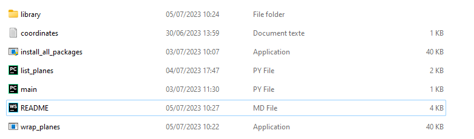

Now we will click on the "wrap_planes.exe" file. It will open a command prompt.

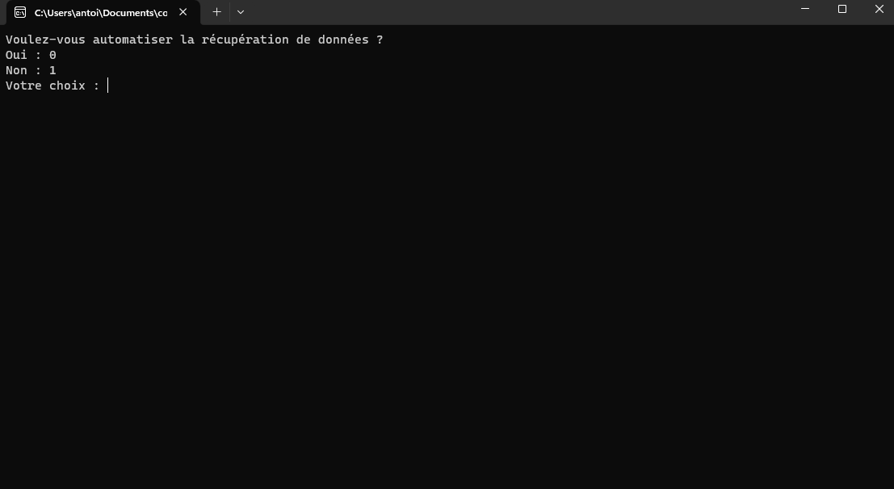

As you can see, it will ask you to choose if you want to automate the process or not. If you choose to automate it, you
will have to type "0" for yes, otherwise, type "1" for no. Let's choose "0" for now, we will follow up step by step the
process.

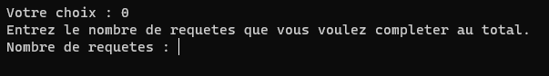

Now, it asks to enter the number of requests you want to make. There is no maximum, but keep in mind the limits of the
API. We will type "2" for now, asking then 2 data retrieval.

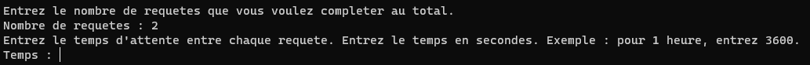

Now, it asks to enter the number of seconds between each request. This is to avoid being blocked by the API. As you can
see, it asks to provide the time in seconds, it is to be accurate in the time calculation between each request. We will
type "10" for ten second. It will do 1 request each 10 seconds and permit us to see what it does.

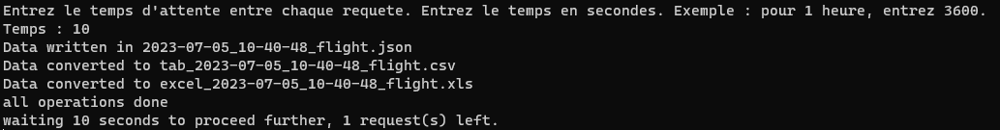

As you see, the data retrieval has started. It will take some time, depending on the number of requests you asked. It
will close automatically once all the requests are done.

This command applies itself in Windows, Linux, and Mac.

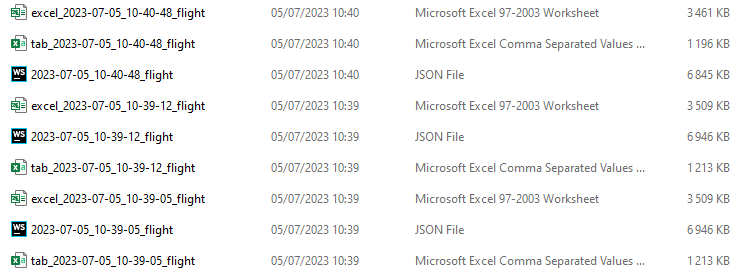

Those are the new files. One of them is a JSON file and the other CSV, it won't interest us, so we can remove them if we
want to. The file with the 'excel_' prefixe is the one that interest us and has the data with the correct format for
usage. Note that if you chose to make multiple requests, there will be multiple files, each one will have the exact time
it was done.

------------

## How to : use the program 'Filter_Flights.exe'

On the dump, you will see a file named 'Filter_Flights.exe'. as for the previous program, the library/ folder mustn't be
touched, modified, or moved.

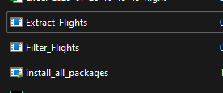

You will have to keep this configuration so the program can work. Now, we'll double-click on the program to open it.

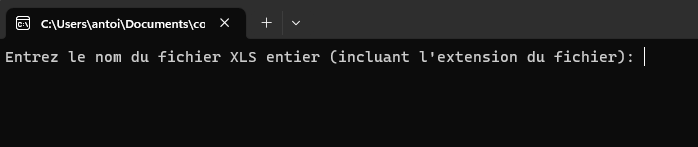

It will ask you to provide the file name that was created. Here, the name of our file is
'excel_2023-07-26_10-15-45_flight.xls'. The naming is quite simple: 'excel' is meant for the XLS version of the file,
the  numbers have the format YYYY-MM-DD_HH_MM_SS (Year, Month, Day, Hour, Minute, Second), and flight.
So actually our current file is: excel_2023-07-26_10-15-45_flight.xls

Let's continue by entering the name of the file.
After pressing enter, you will have the following display : 

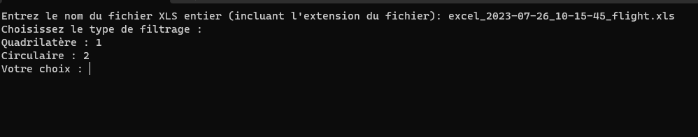

It asks us what we want to do. We will do each one at a time to show how each one functions.

### How to: Square sort

To sort in a square way, we will have to choose 1. Let's type 1 and see what it does.

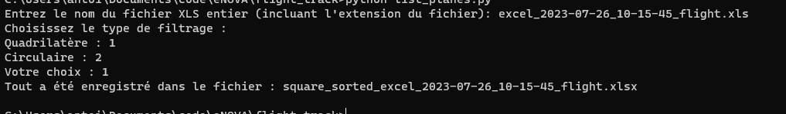

It will sort it in a square way and create the following file: "square_sorted_excel_2023-07-26_10-15-45_flight.xlsx".
The windows will automatically close itself, so you may not see what is written, but you will see your file in your file
explorer:

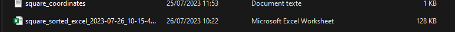

If you want to edit the coordinate filter, you may open the "square_coordinates.txt" file shown one the screenshot, we
will go through it quickly. 

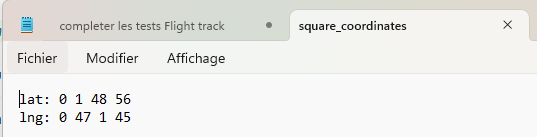

The following format assumes 4 random points with one lat reference and one lng reference. If you want to change anything
in this file, please respect the format already in place, for it to be fully functional. 

### How to: Circle sort

To sort in a circle way, we will have to choose 2. Let's type 2 and see what it does.

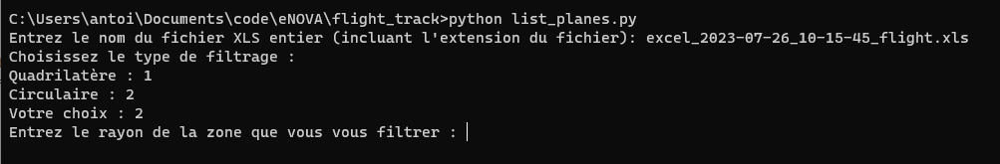

It asks us the radius of the zone we want to cover. The radius is counted in kilometers, so if you type 100, it will be
100-kilometer radius coverage. Let's type 100 and see what it does.

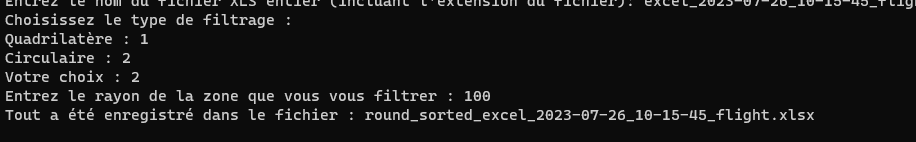

It will sort it in a square way and create the following file: "round_sorted_excel_2023-07-26_10-15-45_flight.xlsx".
The windows will automatically close itself, so you may not see what is written, but you will see your file in your file
explorer:

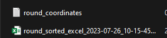

It is mandatory to keep the same format as it won't be functional otherwise.