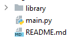
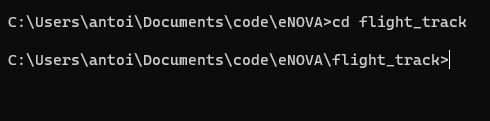
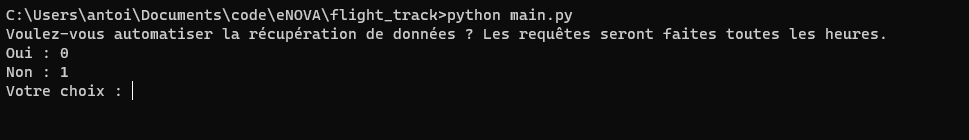
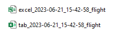
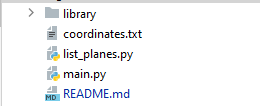
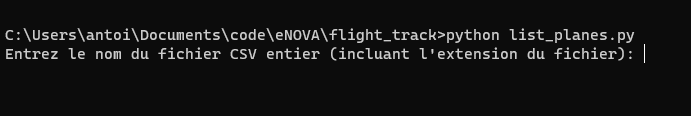
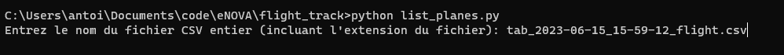
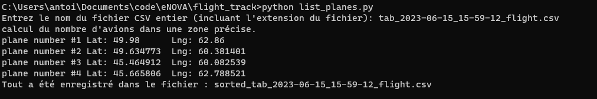
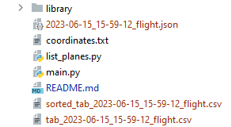
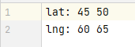

# flight_track

> Project realized by Antoine Rovini, student at Epitech Technology, Promo 2025.

In this program, Airlabs's API is used to retrieve flight data around the globe. Here is a tutorial to help you to use
it.

We have two programs that aren't merged, so we will do use them separately.

Bear in mind that this program isn't automated yet, so you will have to do it manually, and that the usage of this
program is limite to 1000 use per month.

-------------

## How to : use the program 'main.py'

On the dump, you will see a file and a folder. the program is contained in the main.py file and the library in the
folder, so don't delete or modify anything.

you will have to keep this configuration so the program can work.
Now, we'll open a command prompt, and move in the current directory:

Now that we are in the correct directory, we will execute the following command:
> **python main.py**

Once you have entered the command, you will see a prompt asking you to type 0 or 1 to automate the data retrieving of
retrieving data only once. Chose the one you want. We will choose the choice '1' for no.

This command applies itself in Windows, Linux, and Mac.
Once you executed this command, you will have to wait shortly to see new files in your directory:

Those are the new files. One of them is a JSON file, it won't interest us, so we can remove it if we want to. The file
with the 'excel_' prefixe is the one that interest us and has the data with the correct format for usage.

------------

## How to : use the program 'list_planes.py'

On the dump, you will see a file named 'list_planes.py'. as for the previous program, the library/ folder mustn't be
touched, modified, or moved.

You will have to keep this configuration so the program can work. Now, we'll take the exact same command prompt, and
type in the following command:
> **python list_planes.py**
> 
> 

It will ask you to provide the file name that was created. Here, the name of our file is
'tab_2023-06-09_17_02_48_flight.csv'. The naming is quite simple : 'tab' is meant for the CSV version of the file, the
numbers have the format YYYY-MM-DD_HH_MM_SS (Year, Month, Day, Hour, Minute, Second), and flight.
So actually our current file is : tab_2023-06-15_15-59-12_flight.csv

Let's continue by entering the name of the file.

After pressing enter, you will have the following display : 

on this display we see in the pormpt 'plane number #1 Lat: 49.98      Lng: 62.86'. This is subject to be removed in the
long run, but it attests that data has been written. The data will be written in the filename with the 'sorted_' prefix.
You will see it in your file explorer.

For notice, the 'coordinates.txt' file is read by the program to filter the requested zone using 4 point, two lat and
two lng point, as shown in the file:

It is mandatory to keep the same format as it won't be functional otherwise.