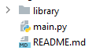
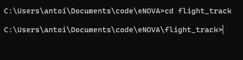
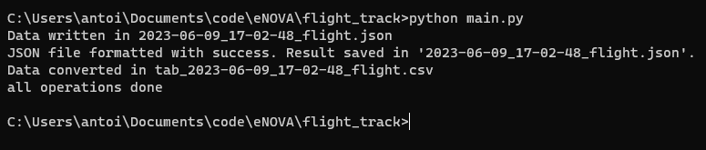
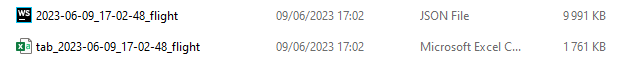

# flight_track

In this program, Airlabs's API is used to retrieve flight data around the globe. Here is a tutorial to help you to use
it.

Bear in mind that this program isn't automated yet, so you will have to do it manually, and that the usage of this
program is limite to 1000 use per month.

-------------

## How to : use the program

On the dump, you will see a file and a folder. the program is contained in the main.py file and the library in the
folder, so don't delete or modify anything.

you will have to keep this configuration so the program can work.
Now, we'll open a command prompt, and move in the current directory:

Now that we are in the correct directory, we will execute the following command:
> **python main.py**

This command applies itself in Windows, Linux, and Mac.
Once you executed this command, you will have to wait shortly to see two new files in your directory:

Those are the two files. One of them is a JSON file, it won't interest us, so we can remov it if we want to. The file
with the 'tab-' prefixe is the one that interest us and has the data with the correct format for usage.
